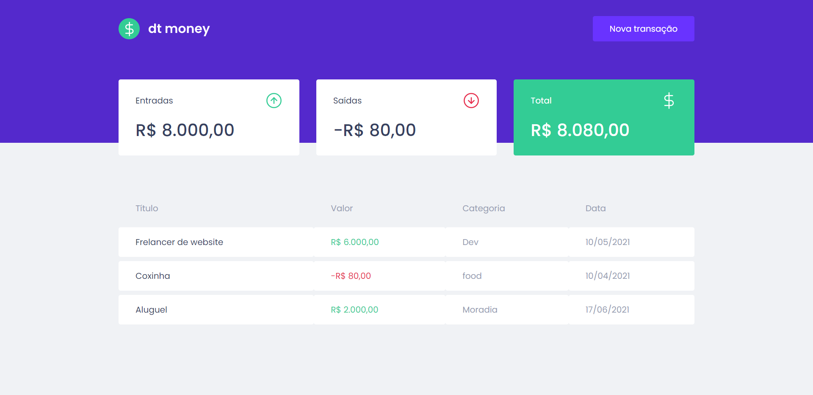

<p align="center">
<a href="#about">About</a>&nbsp;&nbsp;&nbsp;|&nbsp;&nbsp;&nbsp;
<a href="#getting_started">Getting started</a>&nbsp;&nbsp;&nbsp;|&nbsp;&nbsp;&nbsp;
<a href="#technologies">Technologies</a>&nbsp;&nbsp;&nbsp;|&nbsp;&nbsp;&nbsp;
<a href="#contribute">Contribute</a>&nbsp;&nbsp;&nbsp;|&nbsp;&nbsp;&nbsp;
</p>

## 🧐 About <a name = "about"></a>

dt money is an application developed during the **Ignite** offered by [Rocketseat]:rocket:. <br />

The application aims to establish self-control of your finances.

## 🏁 Getting started <a name = "getting_started"></a>

Instructions on how to access routes and installation.

```
git clone https://github.com/GabrielCastilhoV/dtmoney.git

# 💻 Starting the project

Access the folder:
$ cd dtmoney

Install dependencies:
$ yarn

Run the server:
$ yarn start
```

## ⛏️ Technologies <a name = "technologies"></a>

- [TypeScript][typescript]
- [React][reactjs]
- [Styled-components][styled-components]
- [MirageJS][miragejs]
- [Axios][axios]
- [Polished][polished]

## 🤔 Contribute <a name = "contribute"></a>

- Clone this repository: `git clone https://github.com/GabrielCastilhoV/dtmoney.git`
- Create a branch with your feature: `git checkout -b my-feature`;
- Commit your changes: `git commit -m 'feat | my new feature'`;
- Push to your branch: `git push origin my-feature`.

By Gabriel Castilho 👋🏽 [Entre em contato!](https://www.linkedin.com/in/gabrielcastilhov/)

[typescript]: https://www.typescriptlang.org/
[reactjs]: https://reactjs.org
[rocketseat]: https://github.com/Rocketseat
[styled-components]: https://styled-components.com/
[miragejs]: https://miragejs.com/
[axios]: https://github.com/axios/axios
[polished]: https://polished.js.org/
